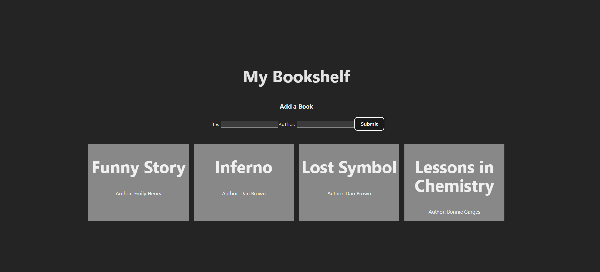

# My bookshelf

The local library is adding a feature to their website where users can add their favorite books to a virtual bookshelf. You’re going to help built the front end UI to make it happen!

You will develop a single component named BookShelf that contains both the controlled form and the display of the bookshelf. Using the useState hook, you will manage the form inputs and list of books, enabling real-time updates to the UI based on user input.

